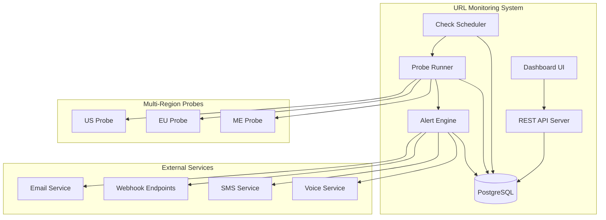

# Design Document: URL Monitoring System

## Overview

The URL monitoring system is designed as a lightweight, reliable monolith that provides uptime monitoring, response time tracking, and multi-channel alerting. The architecture follows a simple pipeline: Scheduler → Probe Runner → PostgreSQL → Alert Engine, ensuring high reliability through simplicity.

The system is built with deployment flexibility as a core principle, running unchanged across AWS, Docker, and on-premises environments. This is achieved through containerization and environment-based configuration.

## Architecture

### High-Level Architecture



### Component Responsibilities

**REST API Server**
- Handles authentication and authorization
- Provides CRUD operations for monitors
- Serves dashboard data
- Manages tenant isolation

**Check Scheduler**
- Maintains monitor configurations
- Schedules checks based on configured intervals
- Distributes work to probe runners
- Handles check queue management

**Probe Runner**
- Executes HTTP/HTTPS requests
- Measures response times
- Validates status codes and SSL certificates
- Records results to database
- Supports multi-region execution

**Alert Engine**
- Monitors check results for failure patterns
- Implements consecutive failure logic
- Triggers notifications through multiple channels
- Handles recovery notifications
- Manages alert state transitions

**Dashboard UI**
- Real-time status display
- Response time visualization
- Uptime percentage calculations
- Historical data presentation

## Components and Interfaces

### Core Data Models

**Monitor**
```typescript
interface Monitor {
  id: string;
  tenantId: string;
  name: string;
  url: string;
  protocol: 'http' | 'https';
  checkInterval: 60 | 300; // seconds
  timeout: number; // milliseconds
  expectedStatusCodes: number[];
  regions: ('us' | 'eu' | 'me')[];
  consecutiveFailureThreshold: number;
  isActive: boolean;
  createdAt: Date;
  updatedAt: Date;
}
```

**Check Result**
```typescript
interface CheckResult {
  id: string;
  monitorId: string;
  region: string;
  timestamp: Date;
  success: boolean;
  responseTime: number | null; // milliseconds
  statusCode: number | null;
  errorMessage: string | null;
  sslExpiryDate: Date | null;
}
```

**Alert**
```typescript
interface Alert {
  id: string;
  monitorId: string;
  type: 'failure' | 'recovery' | 'ssl_expiry';
  severity: 'warning' | 'critical';
  message: string;
  triggeredAt: Date;
  resolvedAt: Date | null;
  notificationsSent: NotificationChannel[];
}
```

### API Endpoints

**Authentication**
- `POST /api/auth/login` - User authentication
- `POST /api/auth/logout` - Session termination
- `POST /api/auth/refresh` - Token refresh

**Monitor Management**
- `GET /api/monitors` - List tenant monitors
- `POST /api/monitors` - Create new monitor
- `GET /api/monitors/{id}` - Get monitor details
- `PUT /api/monitors/{id}` - Update monitor
- `DELETE /api/monitors/{id}` - Delete monitor

**Dashboard Data**
- `GET /api/dashboard/status` - Current status overview
- `GET /api/monitors/{id}/metrics` - Response time metrics
- `GET /api/monitors/{id}/uptime` - Uptime statistics
- `GET /api/alerts` - Recent alerts

**Check Results**
- `GET /api/monitors/{id}/checks` - Historical check results
- `GET /api/monitors/{id}/checks/latest` - Latest check results by region

### Database Schema

**monitors table**
```sql
CREATE TABLE monitors (
    id UUID PRIMARY KEY DEFAULT gen_random_uuid(),
    tenant_id UUID NOT NULL,
    name VARCHAR(255) NOT NULL,
    url TEXT NOT NULL,
    protocol VARCHAR(10) NOT NULL CHECK (protocol IN ('http', 'https')),
    check_interval INTEGER NOT NULL CHECK (check_interval IN (60, 300)),
    timeout INTEGER NOT NULL,
    expected_status_codes INTEGER[] NOT NULL,
    regions TEXT[] NOT NULL,
    consecutive_failure_threshold INTEGER NOT NULL DEFAULT 3,
    is_active BOOLEAN NOT NULL DEFAULT true,
    created_at TIMESTAMP WITH TIME ZONE DEFAULT NOW(),
    updated_at TIMESTAMP WITH TIME ZONE DEFAULT NOW()
);
```

**check_results table**
```sql
CREATE TABLE check_results (
    id UUID PRIMARY KEY DEFAULT gen_random_uuid(),
    monitor_id UUID NOT NULL REFERENCES monitors(id) ON DELETE CASCADE,
    region VARCHAR(10) NOT NULL,
    timestamp TIMESTAMP WITH TIME ZONE NOT NULL,
    success BOOLEAN NOT NULL,
    response_time INTEGER, -- milliseconds
    status_code INTEGER,
    error_message TEXT,
    ssl_expiry_date TIMESTAMP WITH TIME ZONE,
    INDEX idx_monitor_timestamp (monitor_id, timestamp DESC),
    INDEX idx_timestamp (timestamp DESC)
);
```

**alerts table**
```sql
CREATE TABLE alerts (
    id UUID PRIMARY KEY DEFAULT gen_random_uuid(),
    monitor_id UUID NOT NULL REFERENCES monitors(id) ON DELETE CASCADE,
    type VARCHAR(20) NOT NULL CHECK (type IN ('failure', 'recovery', 'ssl_expiry')),
    severity VARCHAR(10) NOT NULL CHECK (severity IN ('warning', 'critical')),
    message TEXT NOT NULL,
    triggered_at TIMESTAMP WITH TIME ZONE NOT NULL,
    resolved_at TIMESTAMP WITH TIME ZONE,
    notifications_sent JSONB NOT NULL DEFAULT '[]'::jsonb
);
```

**tenants table**
```sql
CREATE TABLE tenants (
    id UUID PRIMARY KEY DEFAULT gen_random_uuid(),
    email VARCHAR(255) UNIQUE NOT NULL,
    password_hash VARCHAR(255) NOT NULL,
    notification_settings JSONB NOT NULL DEFAULT '{}'::jsonb,
    created_at TIMESTAMP WITH TIME ZONE DEFAULT NOW()
);
```

## Data Models

### Monitor Configuration Model

The Monitor model encapsulates all configuration needed for URL checking:
- URL validation ensures proper protocol and format
- Check intervals are restricted to supported values (1m, 5m)
- Timeout values have reasonable bounds (1s to 60s)
- Expected status codes support multiple valid responses
- Region selection enables multi-location monitoring
- Consecutive failure threshold prevents false alarms

### Check Result Model

Check results capture the complete state of each monitoring attempt:
- Timestamp precision enables accurate interval calculations
- Success boolean provides quick filtering for uptime calculations
- Response time measurement supports performance monitoring
- Status code recording enables detailed failure analysis
- Error messages provide debugging information
- SSL expiry tracking supports certificate monitoring

### Alert State Model

Alerts track the lifecycle of monitoring issues:
- Type classification enables different handling logic
- Severity levels support escalation policies
- Message content provides human-readable descriptions
- Timestamp tracking enables alert duration calculations
- Resolution tracking supports recovery notifications
- Notification history prevents duplicate alerts

### Tenant Isolation Model

Tenant isolation ensures complete data separation:
- All data models include tenant_id foreign keys
- Database queries include tenant filtering
- API endpoints validate tenant ownership
- Notification settings are tenant-specific
- Authentication tokens include tenant context

## Correctness Properties

*A property is a characteristic or behavior that should hold true across all valid executions of a system—essentially, a formal statement about what the system should do. Properties serve as the bridge between human-readable specifications and machine-verifiable correctness guarantees.*

After analyzing the acceptance criteria, I've identified the following properties that can be consolidated to eliminate redundancy:

**Property Reflection:**
- Properties 1.2 and 1.3 (recording response time and status code) can be combined into a single comprehensive check result property
- Properties 3.3, 3.4, and 3.5 (timeout/status code validation) can be combined into a single check validation property
- Properties 4.2 and 4.3 (SSL alert generation) can be combined into a single SSL alerting property
- Properties 10.1, 10.2, 10.3, and 10.4 (tenant isolation) can be combined into a comprehensive tenant isolation property

### Core Monitoring Properties

**Property 1: URL Request Execution**
*For any* valid HTTP or HTTPS URL configured as a monitor, the system should successfully execute requests to that URL and record the attempt.
**Validates: Requirements 1.1, 1.6**

**Property 2: Complete Check Result Recording**
*For any* check performed, the system should record a complete result including timestamp, success status, response time (if successful), status code (if received), and any error information.
**Validates: Requirements 1.2, 1.3**

**Property 3: Check Validation Logic**
*For any* check result, the success status should be true if and only if the response was received within the timeout period and the status code matches one of the expected status codes.
**Validates: Requirements 1.4, 1.5, 3.3, 3.4, 3.5**

### Configuration Properties

**Property 4: Monitor Configuration Validation**
*For any* monitor creation request, the system should accept valid configurations (including supported intervals, reasonable timeouts, valid status codes, and supported regions) and reject invalid ones.
**Validates: Requirements 2.1, 3.1, 3.2, 5.2, 6.1**

**Property 5: Multi-Region Check Independence**
*For any* monitor configured with multiple regions, checks from different regions should be executed independently and results should be recorded separately by region.
**Validates: Requirements 5.3, 5.4**

### SSL Certificate Properties

**Property 6: SSL Certificate Extraction**
*For any* HTTPS monitor, the system should extract and record the SSL certificate expiry date during successful checks.
**Validates: Requirements 4.1**

**Property 7: SSL Expiry Alerting**
*For any* SSL certificate, the system should generate appropriate alerts (warning for 30-day threshold, critical for 7-day threshold) based on the expiry date, and mark checks as failed for expired certificates.
**Validates: Requirements 4.2, 4.3, 4.4**

### Alert Management Properties

**Property 8: Consecutive Failure Alerting**
*For any* monitor with a configured failure threshold, the system should trigger an alert when consecutive failures reach the threshold and reset the counter when a success occurs.
**Validates: Requirements 6.2, 6.3**

**Property 9: Recovery Notification**
*For any* monitor that has triggered a failure alert, the system should send a recovery notification when the monitor returns to successful status.
**Validates: Requirements 6.4**

**Property 10: Multi-Channel Notification Distribution**
*For any* alert with multiple notification channels configured, the system should send the alert to all configured channels.
**Validates: Requirements 7.6**

### Dashboard and Reporting Properties

**Property 11: Status Display Accuracy**
*For any* monitor, the displayed up/down status should accurately reflect the most recent check result from each configured region.
**Validates: Requirements 8.1**

**Property 12: Response Time Visualization**
*For any* monitor with historical check data, the response time graph should accurately represent all successful checks within the specified time period.
**Validates: Requirements 8.2**

**Property 13: Uptime Calculation Accuracy**
*For any* monitor with check history, the 30-day uptime percentage should equal the ratio of successful checks to total checks over the last 30 days.
**Validates: Requirements 8.3**

**Property 14: Outage Duration Tracking**
*For any* monitor that has experienced failures, the last outage duration should accurately reflect the time between the first failure and the subsequent recovery.
**Validates: Requirements 8.4**

### Security Properties

**Property 15: Authentication Enforcement**
*For any* API request, access should be granted if and only if a valid JWT token is provided.
**Validates: Requirements 9.1**

**Property 16: Credential Validation**
*For any* login attempt, authentication should succeed if and only if the provided credentials match a valid tenant account.
**Validates: Requirements 9.2**

**Property 17: Data Encryption**
*For any* sensitive data (including notification credentials), the stored representation should be encrypted and not readable in plaintext.
**Validates: Requirements 9.3**

**Property 18: Token Lifecycle Management**
*For any* JWT token, the system should enforce expiration times and invalidate tokens upon logout.
**Validates: Requirements 9.4, 9.5**

### Tenant Isolation Properties

**Property 19: Comprehensive Tenant Isolation**
*For any* tenant, all data operations (monitors, checks, alerts, configurations) should be isolated such that no tenant can access another tenant's data through any API operation.
**Validates: Requirements 10.1, 10.2, 10.3, 10.4**

**Property 20: Tenant Audit Trail**
*For any* tenant operation, an audit record should be created and associated with the correct tenant.
**Validates: Requirements 10.5**

### Data Persistence Properties

**Property 21: Check Result Persistence**
*For any* completed check, the result should be successfully persisted to the database and retrievable through subsequent queries.
**Validates: Requirements 12.1**

**Property 22: Monitor Configuration Persistence**
*For any* monitor configuration change, the updated configuration should be successfully persisted and reflected in subsequent operations.
**Validates: Requirements 12.2**

**Property 23: Database Error Handling**
*For any* database connection failure, the system should handle the error gracefully without data corruption or system crash.
**Validates: Requirements 12.4**

**Property 24: Environment Configuration**
*For any* deployment environment, the system should successfully load and apply the appropriate configuration settings.
**Validates: Requirements 11.5**

## Error Handling

### Database Connection Failures
- Implement connection pooling with retry logic
- Graceful degradation when database is unavailable
- Queue critical operations for retry when connection is restored
- Health check endpoints to monitor database connectivity

### Network Failures During Checks
- Distinguish between different types of network failures
- Implement appropriate timeout handling
- Record detailed error information for debugging
- Avoid false positives from temporary network issues

### SSL Certificate Validation Errors
- Handle various SSL certificate issues (expired, invalid, self-signed)
- Provide clear error messages for different certificate problems
- Continue monitoring even when SSL validation fails
- Separate SSL alerts from general connectivity alerts

### Alert Delivery Failures
- Implement retry logic for failed notifications
- Support multiple notification channels as fallbacks
- Log notification delivery status for audit purposes
- Provide admin interface to monitor notification health

### Authentication and Authorization Errors
- Clear error messages for authentication failures
- Proper handling of expired or invalid tokens
- Rate limiting to prevent brute force attacks
- Secure logging that doesn't expose sensitive information

## Testing Strategy

### Dual Testing Approach

The system will employ both unit testing and property-based testing to ensure comprehensive coverage:

**Unit Tests** focus on:
- Specific examples of correct behavior
- Edge cases and error conditions
- Integration points between components
- Mock external dependencies for isolated testing

**Property Tests** focus on:
- Universal properties that hold for all inputs
- Comprehensive input coverage through randomization
- Validation of business rules across all scenarios
- Minimum 100 iterations per property test

### Property-Based Testing Configuration

We will use **fast-check** (for TypeScript/JavaScript) as our property-based testing library. Each property test will:
- Run a minimum of 100 iterations to ensure thorough coverage
- Include a comment tag referencing the design document property
- Use the format: **Feature: url-monitoring, Property {number}: {property_text}**

Example property test structure:
```typescript
// Feature: url-monitoring, Property 3: Check Validation Logic
test('check validation logic', () => {
  fc.assert(fc.property(
    fc.record({
      responseTime: fc.option(fc.nat()),
      statusCode: fc.option(fc.nat()),
      expectedCodes: fc.array(fc.nat()),
      timeout: fc.nat()
    }),
    (checkData) => {
      const result = validateCheck(checkData);
      // Property assertion logic
    }
  ), { numRuns: 100 });
});
```

### Testing Coverage Strategy

**Unit Testing Balance:**
- Focus unit tests on specific examples and edge cases
- Avoid excessive unit tests since property tests handle input coverage
- Emphasize integration testing for component interactions
- Test error conditions and boundary cases explicitly

**Property Testing Focus:**
- Verify universal correctness properties
- Test business rule compliance across all inputs
- Validate data consistency and integrity
- Ensure security properties hold universally

Both testing approaches are complementary and necessary for comprehensive system validation.